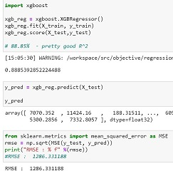
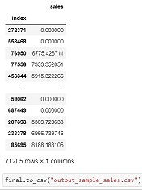

# Shop_Revenue_prediction_IronKaggle
Machine Learning exercise 

## ABOUT
The objective is to predict the revenue of shops. 
5 hours to deliver the results 
Group of 2: [B.M.Pardelhas](https://github.com/bmpardelhas), [Luciefley](https://github.com/luciefley)  

## DATA 
Dataset was given during class. (640840 rows X 9 columns) 
See Data_description.txt 

## MAIN STEPS

- Dataset exploration
- Data cleaning
- Selecting the model 
- Trainning + testing the model
- Improving Predictions, Feature engineering 
- Delivering the results

## TECHNIQUES AND TOOLS

- Data visualization : correlation matrix, heatmap, pairplots - [Matplotlib, Seaborn]
- Pycaret
- Model : xgboost (extreme gradient boosting)

  

## RESULTS
  
and output 
  

## IMPROVEMENTS
To get better predictions, we should have trained the model on the opening days only.
Separating stores according to size (large, medium, small), and flagging december and summer months can help improve the score also.

